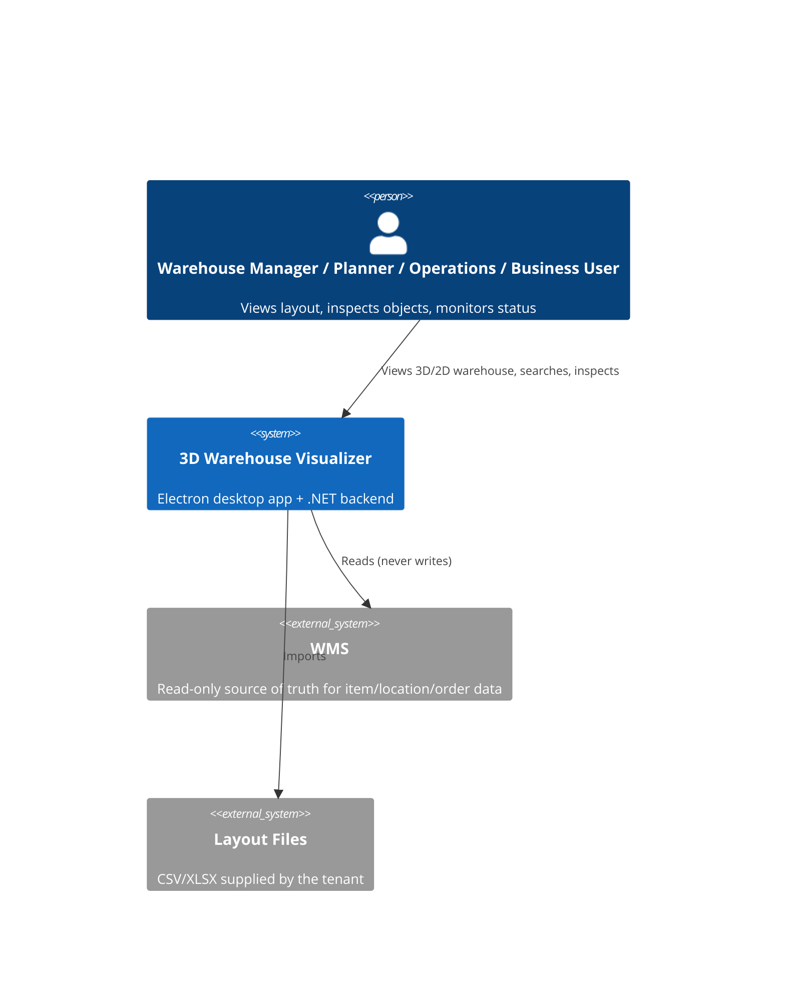
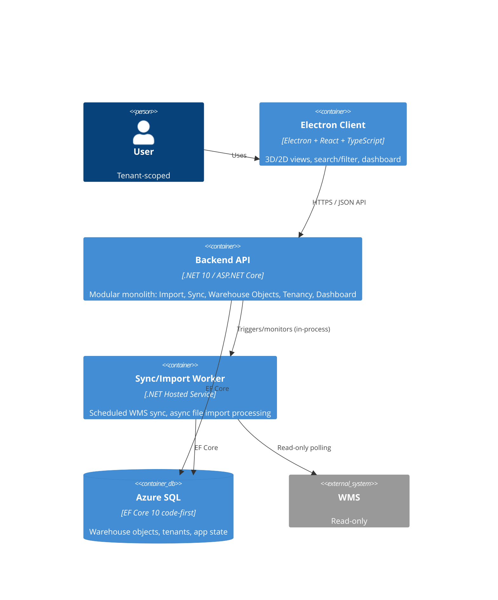
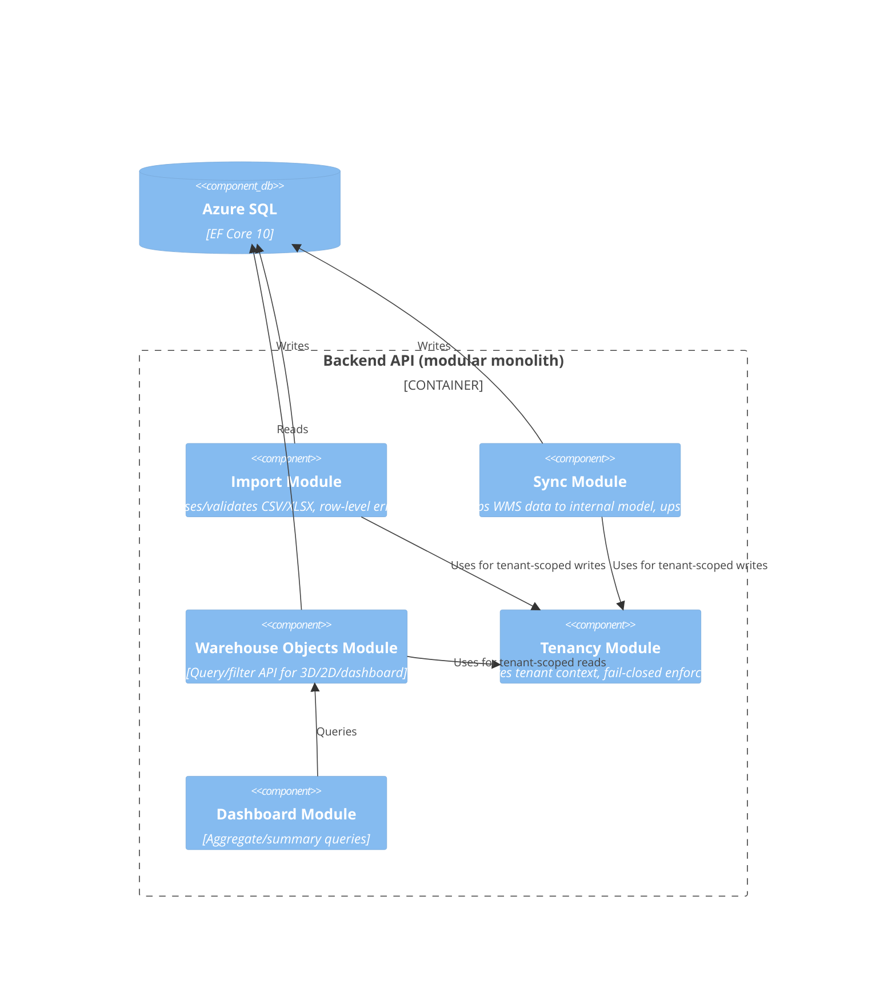
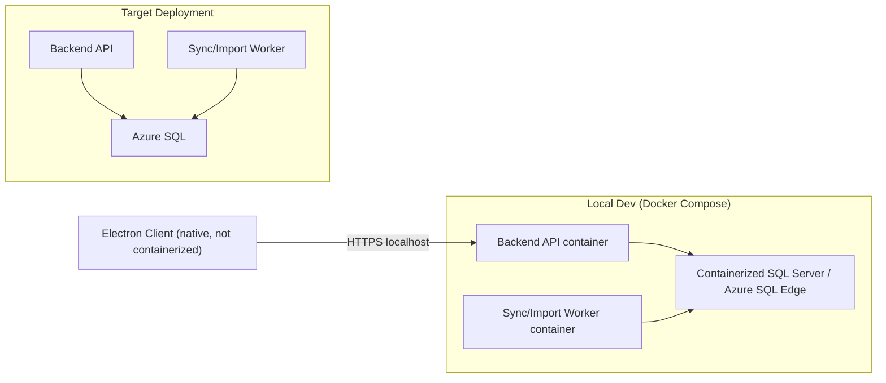
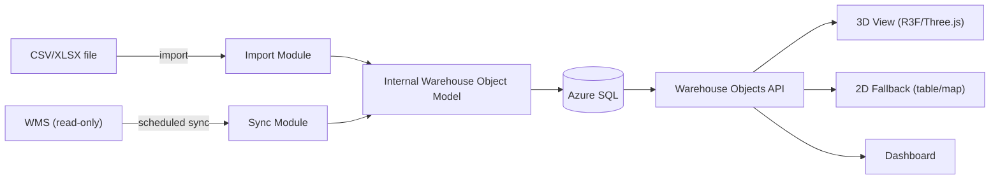

# C4 Views: 3D Warehouse Visualizer

Companion to `high-level-design.md`. Diagrams kept compact; detail lives in the HLD text.

## System Context

## Container

## Key Component (Backend API)

## Deployment / Local Development

## Data Flow (import/sync to render)

